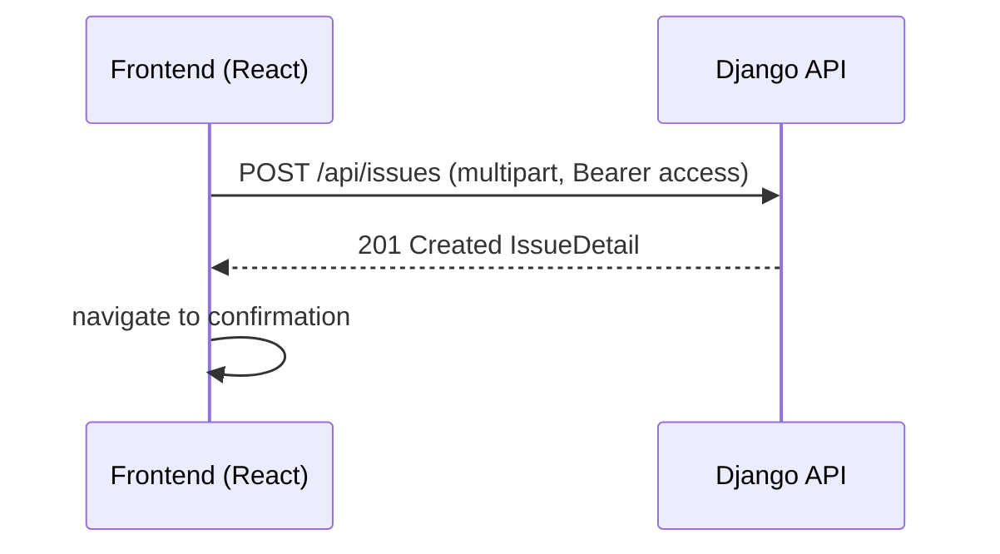
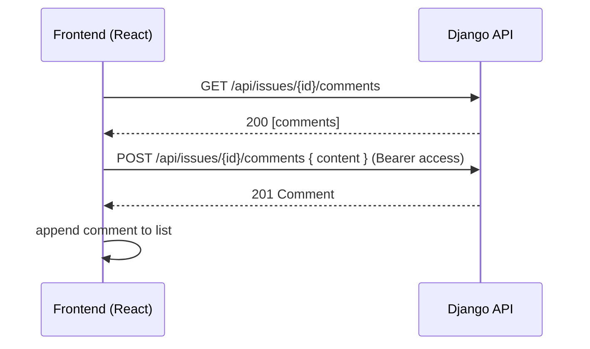

# VoiceLocal Backend (Django) — Architecture, Design, and API Spec

This document describes how to build a fully functional backend for VoiceLocal using Django and Django REST Framework (DRF). It includes:
- Architecture overview and tech stack
- Data model and ERD
- API endpoints and sample payloads
- Auth and authorization rules
- Setup and configuration on Windows (PowerShell)
- Integration notes for the existing React frontend
- Deployment and next steps

---

## 1) Architecture Overview

- Frontend: React + Vite (already in this repo)
- Backend: Django + Django REST Framework (DRF)
- Auth: JWT (djangorestframework-simplejwt)
- Database: PostgreSQL (recommended) or SQLite for local dev
- Media storage: Local filesystem in dev, S3-compatible in prod (optional)
- CORS: django-cors-headers to allow http://localhost:5173 (Vite)
- API Docs: OpenAPI/Swagger via drf-spectacular (optional but recommended)

Request flow:
- Public: Read issues, list feeds
- Authenticated: Post issues, comment, vote

---

## 2) Data Model (ERD)

Core entities:
- User: Authenticated person
- Issue: A community-reported issue (title, description, location, optional image, status)
- Comment: User comment on an issue
- Vote: Upvote/downvote on an issue by a user (unique per user+issue)
- Attachment (optional): Additional images/files per issue

Mermaid ER diagram:

```mermaid
erDiagram
  USER ||--o{ ISSUE : "creates"
  USER ||--o{ COMMENT : "writes"
  USER ||--o{ VOTE : "casts"
  ISSUE ||--o{ COMMENT : "has"
  ISSUE ||--o{ VOTE : "has"
  ISSUE ||--o{ ATTACHMENT : "has"

  USER {
    uuid id PK
    string username
    string email
    datetime date_joined
  }

  ISSUE {
    uuid id PK
    string title
    text description
    string location
    string status  // open | resolved
    string image   // Image URL or file path
    datetime created_at
    datetime updated_at
    uuid author_id FK -> USER.id
  }

  COMMENT {
    uuid id PK
    text content
    datetime created_at
    uuid author_id FK -> USER.id
    uuid issue_id FK -> ISSUE.id
  }

  VOTE {
    uuid id PK
    int value // +1 or -1
    datetime created_at
    uuid user_id FK -> USER.id
    uuid issue_id FK -> ISSUE.id
    // unique(user_id, issue_id)
  }

  ATTACHMENT {
    uuid id PK
    string file
    string caption
    uuid issue_id FK -> ISSUE.id
    datetime created_at
  }
```

Notes:
- Use UUIDs for IDs or standard auto-increment integers. UUIDs provide better security/opacity for public APIs.
- Status choices: "open" or "resolved".
- One image can be stored on the Issue model; more images go to Attachment.

---

## 3) API Design

Base URL: /api

### Auth
- POST /api/auth/register
  - Body: { username, email, password }
  - Response: { id, username, email }
- POST /api/auth/login
  - Body: { email, password }
  - Response: { access, refresh, user: { id, username, email } }
- POST /api/auth/refresh
  - Body: { refresh }
  - Response: { access }
- GET /api/users/me (auth required)
  - Response: { id, username, email }

### Issues
- GET /api/issues
  - Query: search, status, ordering ("-created_at", "upvotes", "comments"), page, page_size
  - Response: paginated list of IssueSummary
- POST /api/issues (auth required)
  - Body (multipart if includes image): { title, description, location, image? }
  - Response: IssueDetail
- GET /api/issues/{id}
  - Response: IssueDetail (includes comments count and tallies)
- PATCH /api/issues/{id} (auth required; owner only)
  - Body: partial fields (title, description, location, status, image)
- DELETE /api/issues/{id} (auth required; owner only)

### Comments
- GET /api/issues/{id}/comments
  - Response: list of Comment
- POST /api/issues/{id}/comments (auth required)
  - Body: { content }
  - Response: Comment
- PATCH /api/comments/{id} (auth required; owner only)
- DELETE /api/comments/{id} (auth required; owner only)

### Votes
- POST /api/issues/{id}/vote (auth required)
  - Body: { value: "up" | "down" }
  - Response: { issue_id, upvotes, downvotes, user_vote }

Optional:
- GET /api/issues/feed (alias of /api/issues with presets)
- File uploads via a dedicated endpoint /api/uploads (or use issue create/patch)

### Common response shapes

IssueSummary:
```json
{
  "id": "...",
  "title": "...",
  "description": "...",  
  "location": "...",
  "image": "https://.../media/...jpg",
  "status": "open",
  "author": { "id": "...", "username": "Sarah" },
  "created_at": "2025-09-19T12:34:56Z",
  "upvotes": 47,
  "downvotes": 3,
  "comments_count": 5
}
```

IssueDetail = IssueSummary + comments[] (optionally paginated):
```json
{
  "id": "...",
  "title": "...",
  "description": "...",
  "location": "...",
  "image": "https://...",
  "status": "open",
  "author": { "id": "...", "username": "Sarah" },
  "created_at": "2025-09-19T12:34:56Z",
  "upvotes": 47,
  "downvotes": 3,
  "comments_count": 5,
  "comments": [
    {
      "id": "1",
      "author": { "id": "...", "username": "Mike" },
      "content": "...",
      "created_at": "2025-09-20T10:00:00Z"
    }
  ]
}
```

Vote response:
```json
{ "issue_id": "...", "upvotes": 48, "downvotes": 3, "user_vote": 1 }
```

Error (standardized):
```json
{ "detail": "Authentication credentials were not provided." }
```

---

## 4) Authorization Rules

- Anyone can read/list issues and comments.
- Only authenticated users can:
  - Create issues
  - Create comments
  - Vote on issues
- Only the author (owner) can edit or delete their own issues/comments.
- Staff/superusers can moderate (optional: delete any content).

---

## 5) Backend Setup (Windows, PowerShell)

Recommended project structure:
```
VoiceLocal/
  backend/           # Django project root
  frontend/          # Your existing React app
```

Steps:

1) Create backend folder and virtual environment
```
# From VoiceLocal directory (parent of frontend)
mkdir backend
cd backend
python -m venv .venv
.\.venv\Scripts\Activate.ps1
```

2) Install dependencies
```
pip install django djangorestframework djangorestframework-simplejwt django-cors-headers Pillow
# Optional: PostgreSQL driver
pip install psycopg2-binary
# Optional: API schema/docs
pip install drf-spectacular
```

3) Start Django project and apps
```
django-admin startproject voicelocal_backend .
python manage.py startapp accounts
python manage.py startapp issues
```

4) settings.py (voicelocal_backend/settings.py)
- Add to INSTALLED_APPS:
```
INSTALLED_APPS = [
  ...,
  'rest_framework',
  'corsheaders',
  'rest_framework_simplejwt',
  # Optional docs
  'drf_spectacular',
  'accounts',
  'issues',
]
```
- Middleware: put corsheaders middleware near top
```
MIDDLEWARE = [
  'corsheaders.middleware.CorsMiddleware',
  ...
]
```
- CORS:
```
CORS_ALLOWED_ORIGINS = [
  'http://localhost:5173',
]
```
- Media (for uploads):
```
MEDIA_URL = '/media/'
MEDIA_ROOT = BASE_DIR / 'media'
```
- DRF + JWT:
```
REST_FRAMEWORK = {
  'DEFAULT_AUTHENTICATION_CLASSES': (
    'rest_framework_simplejwt.authentication.JWTAuthentication',
  ),
  'DEFAULT_SCHEMA_CLASS': 'drf_spectacular.openapi.AutoSchema',
}

SPECTACULAR_SETTINGS = {
  'TITLE': 'VoiceLocal API',
  'DESCRIPTION': 'API for community issues, comments, and votes',
  'VERSION': '1.0.0',
}
```

5) URLs (voicelocal_backend/urls.py)
```
from django.conf import settings
from django.conf.urls.static import static
from django.contrib import admin
from django.urls import path, include
from drf_spectacular.views import SpectacularAPIView, SpectacularSwaggerView

urlpatterns = [
    path('admin/', admin.site.urls),
    path('api/', include('accounts.urls')),
    path('api/', include('issues.urls')),
    path('api/schema/', SpectacularAPIView.as_view(), name='schema'),
    path('api/docs/', SpectacularSwaggerView.as_view(url_name='schema'), name='swagger-ui'),
] + static(settings.MEDIA_URL, document_root=settings.MEDIA_ROOT)
```

6) Accounts app (accounts/models.py)
- Use Django's default User (from django.contrib.auth.models import User)
- If you need profile fields later, create a Profile model with OneToOne to User.

(accounts/serializers.py)
```
from django.contrib.auth.models import User
from rest_framework import serializers

class UserSerializer(serializers.ModelSerializer):
    class Meta:
        model = User
        fields = ['id', 'username', 'email']

class RegisterSerializer(serializers.ModelSerializer):
    password = serializers.CharField(write_only=True)
    class Meta:
        model = User
        fields = ['username', 'email', 'password']

    def create(self, validated_data):
        return User.objects.create_user(**validated_data)
```

(accounts/views.py)
```
from django.contrib.auth import authenticate
from rest_framework import generics, permissions
from rest_framework.response import Response
from rest_framework.views import APIView
from rest_framework_simplejwt.tokens import RefreshToken
from .serializers import RegisterSerializer, UserSerializer

class RegisterView(generics.CreateAPIView):
    serializer_class = RegisterSerializer
    permission_classes = [permissions.AllowAny]

class MeView(APIView):
    permission_classes = [permissions.IsAuthenticated]
    def get(self, request):
        return Response(UserSerializer(request.user).data)

class LoginView(APIView):
    permission_classes = [permissions.AllowAny]
    def post(self, request):
        email = request.data.get('email')
        password = request.data.get('password')
        # Try authenticate by username or email
        user = authenticate(request, username=email, password=password)
        if user is None:
            try:
                from django.contrib.auth.models import User
                u = User.objects.get(email=email)
                user = authenticate(request, username=u.username, password=password)
            except User.DoesNotExist:
                user = None
        if user is None:
            return Response({"detail": "Invalid credentials"}, status=400)
        refresh = RefreshToken.for_user(user)
        return Response({
            'access': str(refresh.access_token),
            'refresh': str(refresh),
            'user': UserSerializer(user).data,
        })
```

(accounts/urls.py)
```
from django.urls import path
from rest_framework_simplejwt.views import TokenRefreshView
from .views import RegisterView, LoginView, MeView

urlpatterns = [
    path('auth/register', RegisterView.as_view()),
    path('auth/login', LoginView.as_view()),
    path('auth/refresh', TokenRefreshView.as_view()),
    path('users/me', MeView.as_view()),
]
```

7) Issues app (issues/models.py)
```
import uuid
from django.db import models
from django.contrib.auth.models import User

class Issue(models.Model):
    STATUS_CHOICES = (
        ('open', 'Open'),
        ('resolved', 'Resolved'),
    )
    id = models.UUIDField(primary_key=True, default=uuid.uuid4, editable=False)
    title = models.CharField(max_length=255)
    description = models.TextField()
    location = models.CharField(max_length=255)
    image = models.ImageField(upload_to='issues/', blank=True, null=True)
    status = models.CharField(max_length=20, choices=STATUS_CHOICES, default='open')
    author = models.ForeignKey(User, on_delete=models.CASCADE, related_name='issues')
    created_at = models.DateTimeField(auto_now_add=True)
    updated_at = models.DateTimeField(auto_now=True)

class Comment(models.Model):
    id = models.UUIDField(primary_key=True, default=uuid.uuid4, editable=False)
    content = models.TextField()
    author = models.ForeignKey(User, on_delete=models.CASCADE, related_name='comments')
    issue = models.ForeignKey(Issue, on_delete=models.CASCADE, related_name='comments')
    created_at = models.DateTimeField(auto_now_add=True)

class Vote(models.Model):
    id = models.UUIDField(primary_key=True, default=uuid.uuid4, editable=False)
    value = models.SmallIntegerField()  # +1 or -1
    user = models.ForeignKey(User, on_delete=models.CASCADE, related_name='votes')
    issue = models.ForeignKey(Issue, on_delete=models.CASCADE, related_name='votes')
    created_at = models.DateTimeField(auto_now_add=True)

    class Meta:
        unique_together = ('user', 'issue')
```

(issues/serializers.py)
```
from rest_framework import serializers
from django.db.models import Sum, Count
from .models import Issue, Comment, Vote
from accounts.serializers import UserSerializer

class CommentSerializer(serializers.ModelSerializer):
    author = UserSerializer(read_only=True)
    class Meta:
        model = Comment
        fields = ['id', 'content', 'author', 'created_at']

class IssueSerializer(serializers.ModelSerializer):
    author = UserSerializer(read_only=True)
    upvotes = serializers.IntegerField(read_only=True)
    downvotes = serializers.IntegerField(read_only=True)
    comments_count = serializers.IntegerField(read_only=True)

    class Meta:
        model = Issue
        fields = ['id','title','description','location','image','status','author','created_at','updated_at','upvotes','downvotes','comments_count']

class IssueDetailSerializer(IssueSerializer):
    comments = CommentSerializer(many=True, read_only=True)
    class Meta(IssueSerializer.Meta):
        fields = IssueSerializer.Meta.fields + ['comments']
```

(issues/views.py)
```
from rest_framework import viewsets, permissions, status
from rest_framework.decorators import action
from rest_framework.response import Response
from django.db.models import Count, Sum, Q
from .models import Issue, Comment, Vote
from .serializers import IssueSerializer, IssueDetailSerializer, CommentSerializer

class IsOwnerOrReadOnly(permissions.BasePermission):
    def has_object_permission(self, request, view, obj):
        if request.method in permissions.SAFE_METHODS:
            return True
        return getattr(obj, 'author', None) == request.user

class IssueViewSet(viewsets.ModelViewSet):
    queryset = Issue.objects.all().select_related('author').prefetch_related('comments__author')
    permission_classes = [permissions.IsAuthenticatedOrReadOnly, IsOwnerOrReadOnly]

    def get_serializer_class(self):
        if self.action in ['retrieve']:
            return IssueDetailSerializer
        return IssueSerializer

    def get_queryset(self):
        qs = super().get_queryset()
        search = self.request.query_params.get('search')
        status_filter = self.request.query_params.get('status')
        ordering = self.request.query_params.get('ordering')
        # annotate counts
        qs = qs.annotate(
            upvotes=Sum('votes__value', filter=Q(votes__value=1)),
            downvotes=Sum('votes__value', filter=Q(votes__value=-1)),
            comments_count=Count('comments'),
        )
        if search:
            qs = qs.filter(Q(title__icontains=search) | Q(description__icontains=search) | Q(location__icontains=search))
        if status_filter in ['open', 'resolved']:
            qs = qs.filter(status=status_filter)
        if ordering in ['-created_at', 'upvotes', 'comments_count']:
            qs = qs.order_by(ordering)
        else:
            qs = qs.order_by('-created_at')
        return qs

    def perform_create(self, serializer):
        serializer.save(author=self.request.user)

    @action(detail=True, methods=['get','post'], permission_classes=[permissions.IsAuthenticatedOrReadOnly])
    def comments(self, request, pk=None):
        issue = self.get_object()
        if request.method == 'GET':
            data = CommentSerializer(issue.comments.all().order_by('created_at'), many=True).data
            return Response(data)
        # POST
        if not request.user.is_authenticated:
            return Response({"detail":"Authentication required"}, status=status.HTTP_401_UNAUTHORIZED)
        serializer = CommentSerializer(data=request.data)
        serializer.is_valid(raise_exception=True)
        serializer.save(author=request.user, issue=issue)
        return Response(serializer.data, status=status.HTTP_201_CREATED)

    @action(detail=True, methods=['post'], permission_classes=[permissions.IsAuthenticated])
    def vote(self, request, pk=None):
        issue = self.get_object()
        value = request.data.get('value')
        if value not in ['up','down']:
            return Response({"detail":"value must be 'up' or 'down'"}, status=400)
        int_val = 1 if value == 'up' else -1
        vote, created = Vote.objects.update_or_create(user=request.user, issue=issue, defaults={'value': int_val})
        from django.db.models import Sum, Q
        aggregates = Issue.objects.filter(pk=issue.pk).aggregate(
            upvotes=Sum('votes__value', filter=Q(votes__value=1)),
            downvotes=Sum('votes__value', filter=Q(votes__value=-1)),
        )
        return Response({
            'issue_id': str(issue.pk),
            'upvotes': aggregates['upvotes'] or 0,
            'downvotes': aggregates['downvotes'] or 0,
            'user_vote': vote.value,
        })

class CommentViewSet(viewsets.ModelViewSet):
    queryset = Comment.objects.all().select_related('author','issue')
    serializer_class = CommentSerializer
    permission_classes = [permissions.IsAuthenticatedOrReadOnly, IsOwnerOrReadOnly]
```

(issues/urls.py)
```
from django.urls import path, include
from rest_framework.routers import DefaultRouter
from .views import IssueViewSet, CommentViewSet

router = DefaultRouter()
router.register('issues', IssueViewSet, basename='issue')
router.register('comments', CommentViewSet, basename='comment')

urlpatterns = [
    path('', include(router.urls)),
]
```

8) Migrate and run
```
python manage.py makemigrations
python manage.py migrate
python manage.py createsuperuser
python manage.py runserver 8000
```

---

## 6) Frontend Integration Notes (mapping to current React)

Current frontend expects:
- Auth: Login page should send email/password to POST /api/auth/login, store access token in localStorage, and save user info. Use Authorization: Bearer <token> on protected calls.
- Navbar: Fetch /api/users/me to show username after login (optional if already returned on login).
- PostIssuePage: POST /api/issues (multipart/form-data if uploading image). Redirect to confirmation on success.
- IssuesFeedPage: GET /api/issues with filters search/status/ordering. For “Post New Issue” button or “Comment” click while unauthenticated, redirect to /login.
- IssueCard (commenting):
  - GET /api/issues/{id}/comments when opening comments (or use IssueDetail endpoint)
  - POST /api/issues/{id}/comments to add a comment
  - POST /api/issues/{id}/vote with { value: "up" | "down" }

HTTP headers for protected requests:
```
Authorization: Bearer <ACCESS_TOKEN>
Content-Type: application/json
```
For uploads:
- Use multipart/form-data; let the browser set Content-Type with boundary.

Handle 401 responses:
- Clear local session, set redirectAfterLogin, route to login.

CORS in Django:
- Ensure CORS_ALLOWED_ORIGINS includes http://localhost:5173

---

## 7) Security & Validation

- Use JWT access/refresh; rotate/short TTL for access tokens.
- Enforce object ownership for update/delete.
- Validate image size and type (Pillow) for uploads.
- Rate limit login and write endpoints (optional: django-ratelimit).
- Enforce strong password policy (Django AUTH_PASSWORD_VALIDATORS).
- Avoid exposing email publicly on issue/comment payloads.

---

## 8) Pagination, Filtering, Sorting

- Use DRF PageNumberPagination (DEFAULT_PAGINATION_CLASS) and PAGE_SIZE (e.g., 10 or 20)
- Filtering:
  - search: title/description/location icontains
  - status: open/resolved
- Sorting (ordering query param): -created_at, upvotes, comments_count

---

## 9) File Uploads

- Dev: store under MEDIA_ROOT; serve via static() in urls.py
- Prod: use cloud storage (S3, GCS) with django-storages
- Validate max size (e.g., 10MB) and allowed types (PNG/JPG)

---

## 10) API Documentation

- drf-spectacular generates OpenAPI at /api/schema/
- Swagger UI at /api/docs/

---

## 11) Environment Variables (.env)

Use python-dotenv or OS env variables:
- SECRET_KEY
- DEBUG=true/false
- DATABASE_URL (if using Postgres; or set ENGINE/NAME/USER/PASSWORD/HOST/PORT)
- CORS_ALLOWED_ORIGINS

Example (development):
```
SECRET_KEY=dev-secret
DEBUG=true
```

---

## 12) Testing

- Unit tests for serializers and permissions
- API tests for endpoints with pytest + pytest-django (recommended)
- Use factory_boy or model_bakery for fixtures

---

## 13) Deployment Checklist (Prod)

- DEBUG = False
- Allowed hosts configured
- Secure cookies, HTTPS, CSRF settings (if using cookie auth)
- JWT settings: appropriate lifetimes
- Database: PostgreSQL, run migrations
- Static and media storage configured (S3 or equivalent)
- CORS: restrict to real domain
- Logging and monitoring (Sentry optional)

---

## 14) Suggested Roadmap

1) Scaffold Django backend and apps (accounts, issues)
2) Implement models, serializers, viewsets, permissions
3) Configure JWT auth and CORS
4) Implement and test endpoints locally with Postman/Swagger
5) Integrate frontend calls (replace mock auth, wire up real endpoints)
6) Add image upload and validation
7) Add search/filter/sort and pagination
8) Add docs and tests
9) Prepare deployment configuration

---

## 15) Sequence Diagrams

Login and redirect flow:
```mermaid
sequenceDiagram
  participant UI as Frontend (React)
  participant API as Django API
  UI->>API: POST /api/auth/login { email, password }
  API-->>UI: { access, refresh, user }
  UI->>UI: store tokens, set user
  UI->>UI: if redirectAfterLogin, navigate there; else to dashboard
```

Post issue flow:


Comment flow:


---

## 16) Mapping to Your Current Frontend

- Replace mock LoginPage handler with a call to POST /api/auth/login; on success, save access token and user in localStorage (you already use localStorage for user).
- Attach Authorization header to protected calls from PostIssuePage, IssueCard (comment and vote), and any future dashboard endpoints.
- Redirect unauthenticated users to login (already implemented in frontend); after successful login, redirect back to post-issue or issues-feed as you do now.

If you want, I can scaffold these backend files for you in a new `../backend` folder next.

